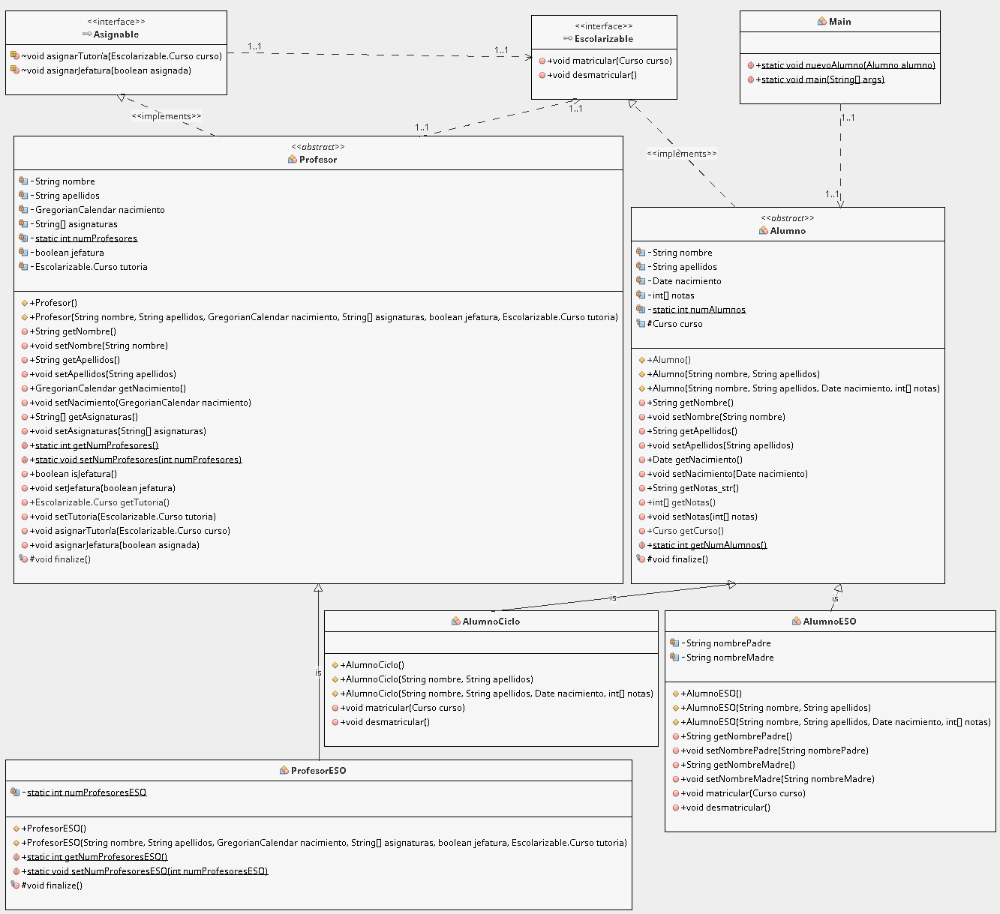

# colegio

- **JOSÉ ANTONIO MUÑOZ JIMÉNEZ**
- **Fecha nacimiento: 28/09/1973**
- **IES Luis Vélez de Guevara**

JAVA: Jerarquía de clases

**Proyecto Java para mostrar el trabajo con jerarquía de clases**.

## Introducción

Para ejecutar en Netbeans, crear un proyecto nuevo y copiar dentro la carpeta `src`.

## Diagrama de clases

> Diagrama realizado con el plugin EasyUML de Netbeans
